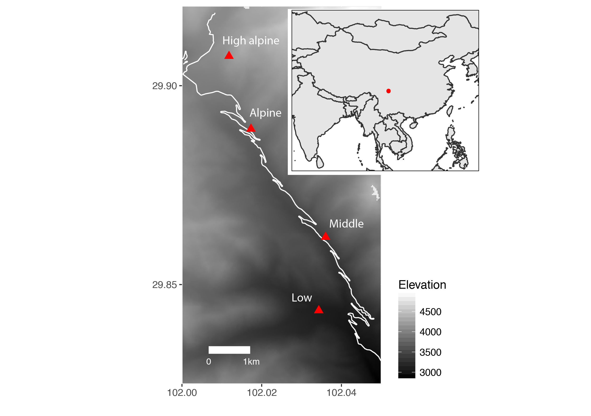
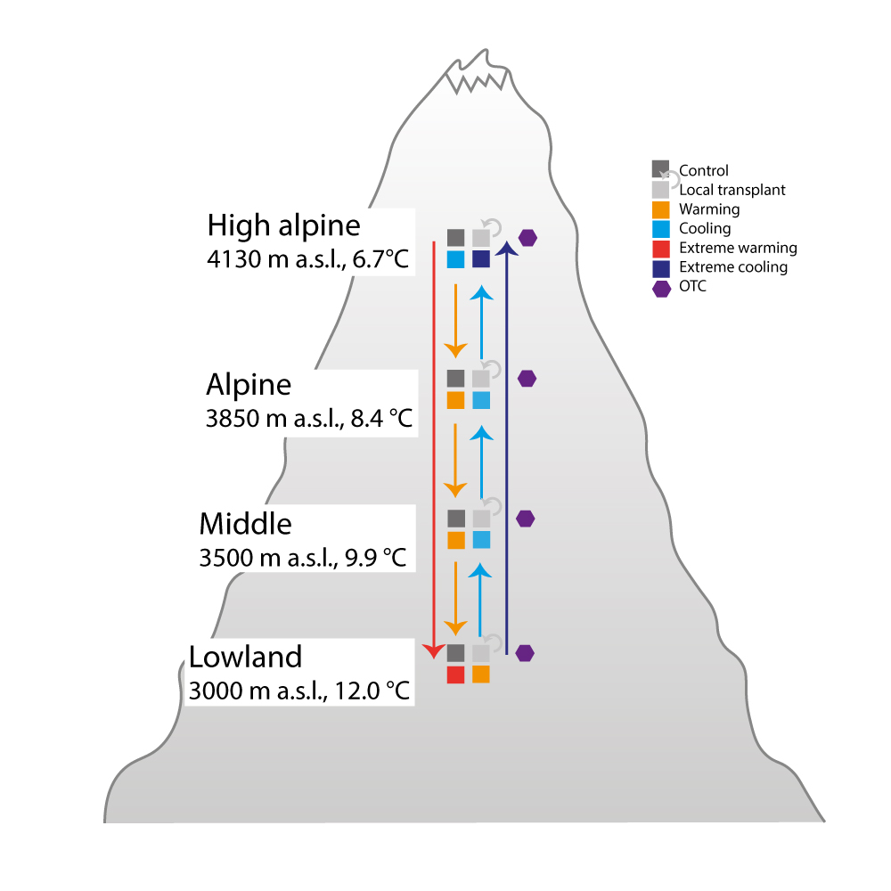

```{r setup, include=FALSE}
library(learnr)
here::here()
knitr::opts_chunk$set(echo = FALSE)
```


This is an R tutorial for working with the Transplant Experiment data in Gongga Mountain, China. The purpose of the tutorial is to be able to download the data, read them and understand their structure before playing with them.

## Site Information

The transplant study is located in the Gongga Mountains in Sichuan Province, south-west China. The study contains four sites spanning from 3000 to 4130 m a.s.l. along an elevational gradient. The vegetation ranges from coniferous-broadleaved forest to alpine meadows.


```{r echo=FALSE, out.width='60%', fig.cap= "Location of the four study sites along an elevational gradient. Inset indicates the locations of the study sites in China.", fig.align='center'}

```

##  Study Information


```{r echo=FALSE, out.width='60%', fig.cap= "Experimental set up for the different warming treatments at each site. Shown are control, local control, OTC, and transplant and arrows indicate direction of transplant",fig.align='center'}

```

## Install packages

First, is important to install all packages needed. The code in the file "setup.R" will do this and check you have a recent version of R.

Run this script first to check required packages installed 

```{r instal_packges, echo=TRUE, eval=FALSE, warning=FALSE, message=FALSE }

# Check recent version of R installed
if(getRversion() < "3.6.0") {
  stop("##########\nOld version of R\nPlease install latest version\n##########")
}

# Check recent version of Rstudio installed
if(RStudio.Version()$version < "1.0.1"){
  stop("##########\nOld version of Rstudio\nPlease install latest version\n##########")
}


# Check CRAN packages installed
CRAN_needed <- c(
  "tidyverse", #this includes dplyr, ggplot, tidyr etc
  "vegan",
  "RSQLite",
  "DBI",
  "remotes",
  "patchwork",
  "rmarkdown")

# Check against currently installed packages
installed_packages <- .packages(all.available = TRUE)
CRAN_needed2 <- CRAN_needed[!CRAN_needed %in% installed_packages]

# Download missing CRAN packages
if(length(CRAN_needed2) > 0){
  install.packages(CRAN_needed2)
}

# Install libraries from GitHub:

remotes::install_github("gavinsimpson/ggvegan", upgrade = FALSE)
remotes::install_github("Between-the-Fjords/dataDownloader", upgrade = FALSE)

# Check all packages downloaded if this line doesn't work - assert that didn't install

stopifnot(all(c(CRAN_needed, "ggvegan", "dataDownloader") %in% .packages(all.available = TRUE)))

# clean-up
rm(CRAN_needed, CRAN_needed2, installed_packages)
```

## Load the packages

```{r load_packages, echo=TRUE, eval=FALSE, warning=FALSE, message=FALSE}
library("tidyverse")
library("dataDownloader")
library("DBI")
library("vegan")
library("ggvegan")
library("patchwork")
```

## Download the data

Download the data and store it in the proper files

Instructions to download the Data

Location of PFTC Data:

- The data are located in OSF repository

- To know the exact location of each PFTC Data check this file: [Here](https://docs.google.com/spreadsheets/d/1y81Xv33BaoWV2FNx0F9XbikjKeHLGNxfmWZ2w4xmISk/edit#gid=0])

## COMMUNITY DATA

China community data from the transplants:

```{r Download the community data,  echo=TRUE, eval=FALSE, warning=FALSE, message=FALSE}
get_file(node = "4hjzu",
         file = "transplant.sqlite",
         path = "community/data")
```

## TRAIT DATA

- China traits: Leaf traits

```{r Download the trait data,  echo=TRUE, eval=FALSE, warning=FALSE, message=FALSE}
get_file(node = "emzgf",
         file = "PFTC1.2_China_2015_2016_LeafTraits.csv",
         path = "traits/data")
```


## Chemical traits

```{r Download the chemical data,  echo=TRUE, eval=FALSE, warning=FALSE, message=FALSE}
get_file(node = "emzgf",
         file = "PFTC1.2_China_2015_2016_ChemicalTraits.csv",
         path = "traits/data")
```

## Read the data

### Cover and composition data

The script to read and process the cover data is in "hidden" folder:

```{r Cover ans composition, echo=TRUE, eval=FALSE, warning=FALSE, message=FALSE}
source("hidden/start_here.R")
```

This script is going to:
  
1. Read the data from the transplants (transplant.sqlite)
2. Load cover data and metadata (cover_thin)
3. Make a wide table (cover) with species names in columns and cover values in each plot
4. Make meta data (cover_meta) This are the meta data of the "cover" tibble

We can either source it or run it step by step to see what is doing (preferred option). If you want to run it step by step then open the file.

## Trait data

The traits data are located in China/traits/data, in two files: LeafTraits and ChemicalTraits. 
                                                            To read the csv files:
```{r Trait data, echo=TRUE, eval=FALSE, warning=FALSE, message=FALSE}
traitsLeaf <- read_csv(file = "traits/data/PFTC1.2_China_2015_2016_LeafTraits.csv")

traitsChem <- read_csv(file = "traits/data/PFTC1.2_China_2015_2016_ChemicalTraits.csv")
```
                                                                                                                 
                